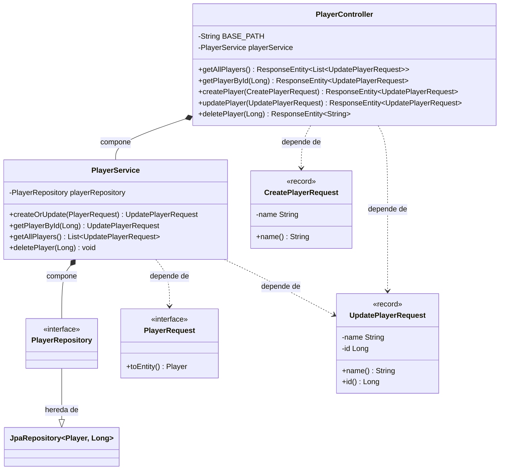
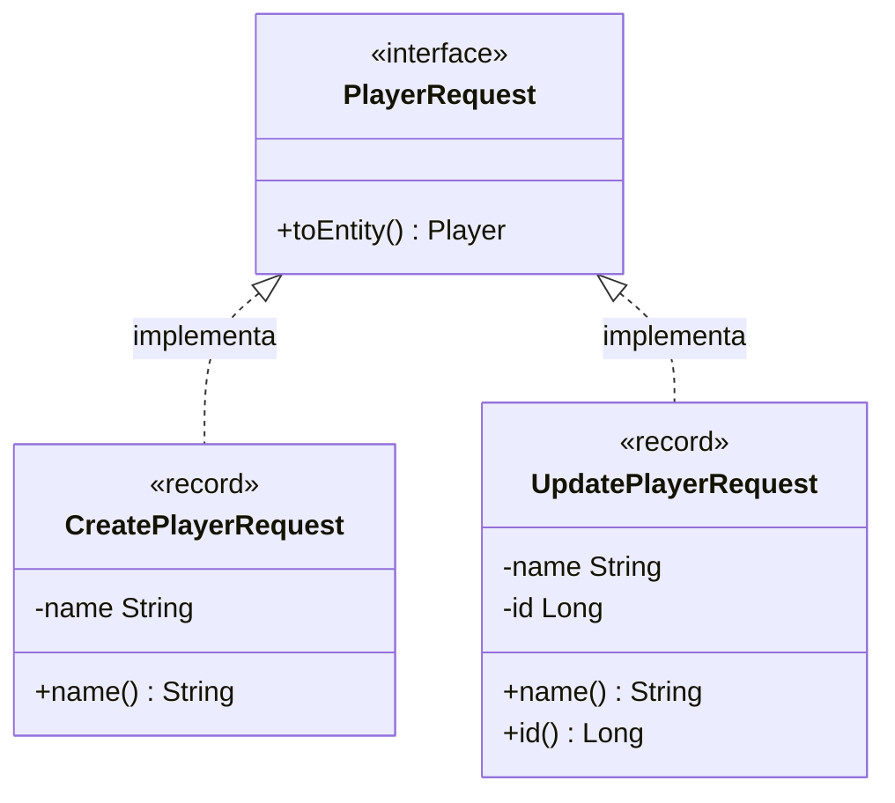
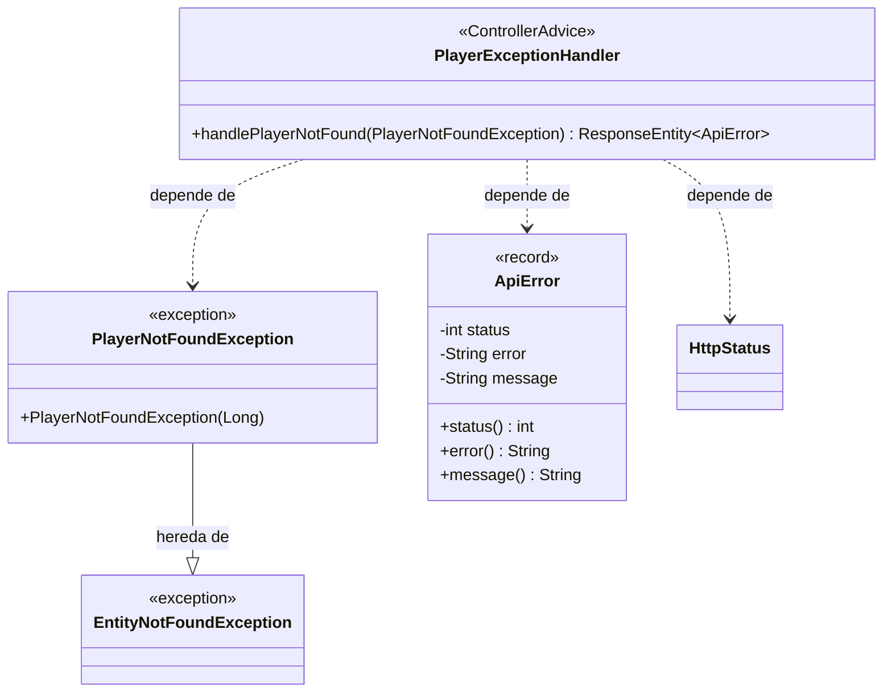

Este módulo contiene todo lo relacionado con el modelo Player en el sistema. Desde la entidad, sus excepciones, servicios, repositorio y capa de aplicación. 

## **Vistazo general**
En este diagrama se da un vistazo general del ecosistema, sus relaciones de dependencias y de composición:


## **Interfaz PlayerRequest**
Aqui más en detalle podemos ver la interfaz PlayerRequest y sus implementaciones, este paquerte contiene los DTOs necesarios para procesar las interacciones con el cliente sin romper el encapsulamiento.


## **Manejo de excepciones**
Y aquí un diagrama que expresa las relaciones entre las excepciones, como se capturan y formatean para responder al cliente en caso de peticiones incompletas/erróneas (códigos 4XX).



## **Contrato de la API**

Todos los endpoints que permiten interactuar con el módulo player desde un **cliente REST** se agrupan sobre la siguiente url: ``http://localhost:8080/api/player/**``

### Resumen

| Método | Endpoint | Descripción | Códigos de estado
|--------|----------|-------------|------------------|
| POST   | /api/player | Crear jugador | 201         |
| GET    | /api/player | Obtener todos | 200         |
| GET    | /api/player/{id} | Obtener por ID | 200, 404| 
| PUT    | /api/player/{id} | Actualizar jugador | 200 |
| DELETE    | /api/player/{id} | Eliminar jugador | 204, 404|

### Headers requeridos

Para los endpoints que devuelven respuesta, es necesario adjuntar los siguientes headers:

    Content-Type: application/json


### Endpoints
??? "Crear jugador (POST /api/player)"

    **Descripción:** 
    Crea un nuevo jugador en el sistema y devuelve al cliente una respuesta en formato JSON como la del siguiente ejemplo: 

    **Formato de la petición**
    ```json
    {
        "name": "Maestro Rossi"
    }
    ```

    **Formato de la respuesta body** 
    ```json
    {
        "name": "Maestro Rossi",
        "id": 1
    }
    ```

    **Headers que incluye la respuesta**

    | Key | Value |
    |-----|-------|
    | Location | /api/player/1|
    | Content-Type | application/json|

    **Código de estado HTTP**

    - 201 Created


??? "Obtener jugadores (GET /api/player)"

    **Descripción**
    Devuelve todos los jugadores o un jugador seleccionado por id.

    **Formato de la petición**

    No requiere body.

    **Formato de la respuesta**
    ```json
    [
        {
            "name": "Maestro Rossi",
            "id": 1
        }

        // más jugadores...
    ]
    ```
    **Código de estado HTTP**

    - 200 OK

??? "Obtener jugador por id (GET /api/player/{id})"

    **Descripción** 

    Obtiene un jugador por su id. 

    **Formato de la petición**

    No requiere body.

    **Formato de la respuesta**

    Respuesta exitosa: 
    ```json
    {
        "name": "Maestro Rossi",
        "id": 1
    }
    ```

    Respuesta fallida:  

    ```json
    {
        "status": 404,
        "error": "Not Found",
        "message": "Player with id: 1 not found"
    }
    ```

    **Código de estado HTTP**

    - 200 OK
    - 404 Not Found

??? "Actualizar jugador (PUT /api/player/{id})"

    **Descripción**

    Actualiza el nombre de un jugador mediante su id. El id de del jugador actualizado debe coincidir en el body y en el endpoint.

    **Formato de la petición**
    ```json
    {
        "name": "Peter Parker",
        "id": 1
    }
    ```
    **Formato de la respuesta**
    ```json
    {
        "name": "Peter Parker",
        "id": 1
    }
    ```
    **Código de estado HTTP**

    - 200 OK

??? "Eliminar jugador (DELETE /api/player/{id})"

    **Descripción**

    Elimina un jugador mediante su id. 

    **Formato de la petición**

    No requiere body ni headers.  

    **Formato de la respuesta**

    Sin respuesta, exceptuando casos de error, en cuyo caso recibirás una respuesta con el siguiente formato: 

    ```json
    {
        "status": 404,
        "error": "Not Found",
        "message": "Player with id: 1 not found"
    }
    ```

    **Códigos HTTP**

    - 204 No Content
    - 404 Not Found

